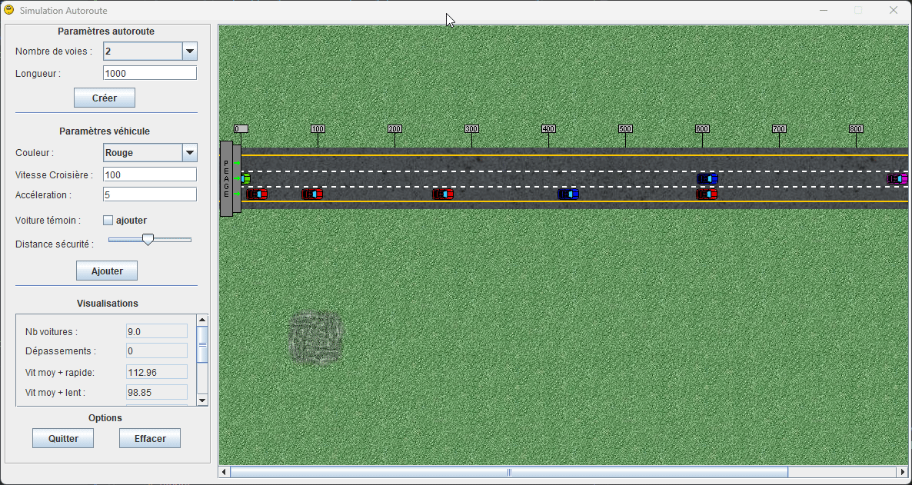

# Highway simulator

**Java Swing** application that simulates car traffic on a highway.


---

# Table of Contents

* [About the project](#about-the-project)
* [Usage](#usage)
* [Description](#description)
* [Technical details](#technical-details)
* [License](#license)

# About the project


This is a simple GUI application (in French) that simulates cars driving on a highway, one of my first school project!

The purpose of the project is the simulation of the car traffic on a highway, the program simulates
the evolution of speed, lanes and positions of a set of cars arriving at regular intervals, and on
the other hand produces information on this evolution.

Application has been built on **November 2006** using **Netbeans IDE 5.0**.

It uses **Swing** and the **Graphics2D** library, and was compiled with **Java 1.4**.



# Usage

Run the provided `.jar` file :

```bash
java -jar "highway-simulator.jar"
```

Then just use the UI :


The application allows to :

- create a new **highway** with the following parameters :
    - number of **lanes** (`2` to `4`)
    - length (meters, from `100m` to `10000m`)
- add a **vehicle** with the following parameters :
    - color (`red`, `green`, `blue`, `yellow`, `purple`)
    - cruising speed (max `200km/h`)
    - acceleration
    - safety distance
    - "control" car or not ("control" car is a special car that will be tracked independently for statistics, it will be `black` and identified with a `T` as shown below)
- visualize some parameters like :
    - number of cars currently running
    - number of overtakes
    - average speeds :
        - faster car
        - slower car
        - all cars
- view **statistics** from generated text files :
    - session statistics (`Session.txt`)
    - control car statistics (`VehiculeTemoin.txt`)

A "control" car identified with a `T` :


# Description

Cars drive by default on a 2-lane highway. They arrive at the highway in an initial position at different intervals,
and with an initial speed of `0`. The behavior of a car is simulated until it reaches an exit position.

There are several kinds of parameters that affect the behavior of a car :

- specific parameters to each car which do not vary during execution time (safety distance, cruising speed and acceleration)
- specific values to each car which evolve during execution time (current speed, track, position)

So the input data of the simulation program will therefore consist of :

- the safety distance
- the highway length
- the interval between each arrival of a car at the entrance
- a list of cars specifying, for each of them, its acceleration, cruising speed, and an identification color

We consider that a lane is free for a car if there is no other vehicle on the same lane between the
positions `P(c)` and `P(c) + D(c)`. A lane is said to be free for a car if there is no other vehicle
between the positions `P(c)-200m` and `P(c) + D(c)`.

There are two modes of traffic: _overtake_ mode and _standard_ mode.

1. In _standard_ mode, a car drives on the right lane. If this lane is free, the car runs at its
   cruising speed or accelerates until it reaches its cruising speed. If the lane is not free, then
   it takes care of the state of the left lane :

- if the left lane is free, the car begin overtaking
- otherwise the car slows down

2. In _overtaking_ mode, a car changes lane to go on the left lane (it is assumed that this change of lane is instantaneous).
   It stays on this lane as long as it is in _overtaking_ mode. It leaves the _overtaking_ mode when the following conditions are met:

- its position is located after the one of the vehicle which was right in front of it at the beginning of the overtaking
- the right lane is free

During the entire duration of the overtaking, if the left lane is free, the car drives at its cruising speed or accelerates until it reaches cruising speed.
If this lane is not free, it slows down.

Finally, the program allows to identify a "control" car, and will record in a text file the positions and other parameters of this car.

# Technical details

The application consists of several classes :

Base classes :

- `Vehicule` : represent a car and offers all functions related to it
- `Autoroute` : represent the highway and offers all functions related to it
- `EcritDansFichier` : Take care of writing into the `Session.txt` statistics file
- `EcritVehiculeTemoin` : Take care of writing the `VehiculeTemoin.txt` statistics file

Frames :

- `Fenetre` : Main frame of the application, it contains the `PanelRoute` and `PanelCommandes` panels (see below) to display the whole GUI
- `FenetreFichier` : Frame representing the window displaying the "control" car statistics
- `FenetreFichierSession` : Frame representing the window displaying the whole session statistics

Panels :

- `PanelCommandes` : This panel contains the different components allowing to change the settings that will affect the program. This class implements the `InterfaceCommande`
  interface which allows to communicate with the `PanelRoute` class using **listeners**
- `PanelRoute` : This Panel contains the drawing that displays the movement of vehicles on the highway. It is intended to be added in the `Fenetre` frame to be displayed on the
  screen next to the Panel containing the commands

The `Main` class is the entry point of the application.

The `InterfaceCommande` interface describes the actions that will need to be implemented by classes that need to listen to changes like car speed, position, etc.  (
extends `EventListener`).

The default display of **AWT** or **Swing** components uses a simple buffer (we can see the image being drawn).
When building complex animations, it may cause flickering of the image (clipping).
To solve this issue, we can use the **double-buffering** technique. Double buffering is having 2 buffers,
a "back" buffer that processes the drawing stuff in memory, and a "front" buffer that takes care of the display.
Problems of refresh, image jump and other disruptive visuals effects are thus eliminated.


Using a double buffer is particularly recommended for displaying complex animations or large components.

# License

[General Public License (GPL) v3](https://www.gnu.org/licenses/gpl-3.0.en.html)

This program is free software: you can redistribute it and/or modify it under the terms of the GNU
General Public License as published by the Free Software Foundation, either version 3 of the
License, or (at your option) any later version.

This program is distributed in the hope that it will be useful, but WITHOUT ANY WARRANTY; without
even the implied warranty of MERCHANTABILITY or FITNESS FOR A PARTICULAR PURPOSE. See the GNU
General Public License for more details.

You should have received a copy of the GNU General Public License along with this program. If not,
see <http://www.gnu.org/licenses/>.